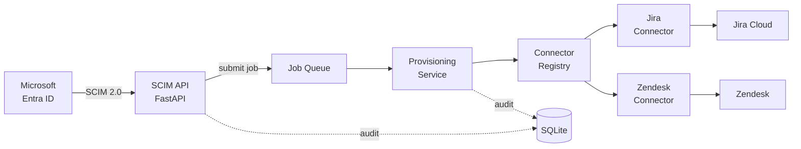
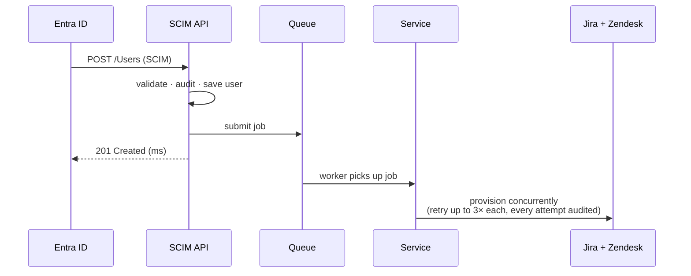
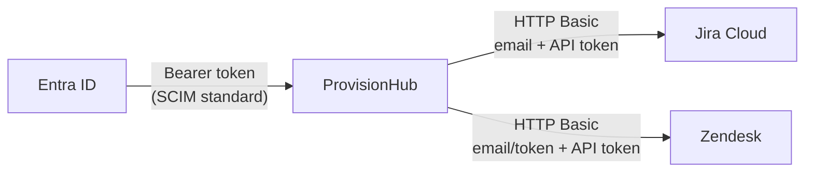

# ProvisionHub — Architecture & Data Model

SCIM 2.0 user provisioning service between Microsoft Entra ID and downstream SaaS apps (Jira, Zendesk).

---

## 1. Project Scope

**In scope (v1):**

- Joiner flow — a user created in Entra is provisioned into every connected app
- SCIM 2.0 Users resource: create, get by id, list with `userName eq "x"` filter
- Full audit trail of every inbound request and every outbound HTTP attempt
- Two connectors: Jira and Zendesk

**Out of scope (v1):** Groups, mover/leaver flows, multi-tenancy, SCIM Bulk.

---

## 2. Requirements

### Functional

| #   | Requirement                                                                                         |
| --- | --------------------------------------------------------------------------------------------------- |
| F1  | Accept SCIM 2.0 user provisioning requests from Microsoft Entra ID                                  |
| F2  | Store a canonical user record independent of any downstream app                                     |
| F3  | Provision the user into every enabled downstream app (Jira, Zendesk)                                |
| F4  | Answer SCIM lookups (`GET /Users/{id}`, `GET /Users?filter=userName eq "x"`) so Entra can reconcile |
| F5  | Record every inbound request and every outbound HTTP attempt for audit                              |

### Non-Functional

| #   | Requirement                                                                                 | How it's met                                                                     |
| --- | ------------------------------------------------------------------------------------------- | -------------------------------------------------------------------------------- |
| N1  | **Fast response to the identity provider** — Entra must never wait on a slow downstream app | Route returns 201 in milliseconds; work happens on a background queue            |
| N2  | **Resilience** — downstream apps fail; the system must absorb it                            | 3 retries with exponential backoff (1s / 4s / 16s), per connector, independently |
| N3  | **No duplicate accounts** — retries must be safe                                            | Idempotency: lookup by `external_id` before any create                           |
| N4  | **Auditability** — every action traceable end to end                                        | Insert-only audit tables + correlation ID through every layer                    |
| N5  | **Extensibility** — adding an app must not touch core code                                  | Connector registry: one new file + one registration line                         |

### What we care about most

Two things drove every architecture decision:

1. **Auditability** — provisioning is a security control. "Who got access, when, triggered by what" must be answerable with one query, not an investigation.
2. **Clean seams** — the queue and the connector registry are interfaces. The infrastructure behind them (broker, new apps) can change without touching the core.

---

## 3. Component Architecture



How to read it, left to right:

1. **Entra sends a SCIM request.** The API validates it, writes an audit row, saves the canonical user, puts a job on the queue, and returns **201 immediately**.
2. **The queue decouples accepting work from doing work.** A background worker pulls jobs off it. Today it's an in-process `asyncio.Queue`; a real broker (Redis/SQS) slots in behind the same `submit(job)` interface.
3. **The service fans out to all registered connectors concurrently** — Jira and Zendesk are called at the same time, each with its own retries. The service never names a connector; it just iterates the registry.
4. **Each connector maps the canonical user to its app's format** and makes the HTTP calls. Adding a new app = one new connector file + one registration line. Nothing else changes.

---

## 4. Request Flow



The line that matters: **201 goes back before any downstream call happens.** A slow or down Jira can never time out the identity provider.

---

## 5. Security — Authentication at Both Edges

The service has two trust boundaries: who can talk **to** it, and how it talks **to** the downstream apps.



### Inbound — Entra → ProvisionHub

- **Bearer token auth** on every SCIM endpoint — this is how Entra authenticates to SCIM endpoints by design (you paste the token into the Entra provisioning config).
- Enforced as a FastAPI dependency on the whole router — no endpoint can be added without auth; it's opt-out, not opt-in.
- Missing or wrong token → `401`, before any handler runs.
- v1 uses a single static token from settings. The dependency signature is unchanged if this becomes a per-IdP token or JWT later.

### Outbound — ProvisionHub → downstream apps

- **Jira:** HTTP Basic with admin email + API token (Atlassian's standard for REST API v3).
- **Zendesk:** HTTP Basic with `email/token` + API token (Zendesk's API token scheme).
- Credentials live in environment variables via `.env` — never in code, never in the repo.
- Each connector owns its own credentials and HTTP client. Adding an app with a different auth scheme (OAuth, mTLS) touches only that connector.

### Other controls

- **Input validation:** every SCIM payload is parsed through Pydantic before it touches the database — malformed input is rejected at the boundary.
- **Audit:** every accepted request and every outbound attempt is logged (see section 6).

---

## 6. Database — Table Roles

Four tables. Two of them are insert-only audit tables — application code never UPDATEs or DELETEs them.

| Table                 | Role                                                                      | Mutability      |
| --------------------- | ------------------------------------------------------------------------- | --------------- |
| `users`               | Canonical user — one shape, no app-specific fields                        | Read/write      |
| `provisioning_events` | Inbound audit — one row per accepted SCIM request                         | **Insert-only** |
| `connector_calls`     | Outbound audit — one row per HTTP **attempt** (a retry is a new row)      | **Insert-only** |
| `user_remote_ids`     | Maps our user → its id in each downstream app; enables idempotent retries | Upsert          |

### Tracing one request

The correlation ID assigned at the front door is the join key for the whole trail:

```
correlation_id
  → provisioning_events   (what came in)
      → connector_calls   (what went out: which app, which attempt, what happened)
```

One query answers: _what came in, what went out, to which app, how many attempts, what was the result._

---

## 7. Architecture Decision — The Connector Registry

The core design decision in this project: **adding a downstream app must not touch core code.**

### How it works

- The `ProvisioningService` iterates `registry.enabled()` and fans out to every connector. It never names one — there is no `if connector == "jira"` anywhere in the core.
- `main.py` is the **only file in the codebase** that knows Jira or Zendesk exist. That's where connectors are constructed with their credentials and registered.

### Adding a new app (e.g. ServiceNow)

```
1. connectors/servicenow.py          ← new file: map canonical User → ServiceNow, make the calls
2. main.py: registry.register(...)   ← one line
```

That's it. Untouched: the SCIM API, the queue, the service, the retry logic, the audit schema, the canonical user model, the database.

### Why it matters

In a provisioning product, the connector catalog **is** the product. The cost of adding app #3, #10, #50 has to stay flat. This pattern makes each new app an isolated, independently testable module instead of another branch in a growing core.

---

## 8. Project File Structure

```
src/provisionhub/
├── main.py                  # the ONLY file that knows which connectors exist
├── config.py                # settings: DATABASE_URL, tokens, connector creds
│
├── api/                     # ── inbound edge
│   ├── scim_users.py        #   SCIM routes: POST /Users, GET /Users, GET /Users/{id}
│   ├── auth.py              #   Bearer-token dependency on the whole router
│   └── middleware.py        #   assigns correlation_id to every request
│
├── domain/                  # ── canonical model
│                            #   SCIM models + canonicalize() → one internal User shape
│
├── provisioning/            # ── the work
│   ├── queue.py             #   SEAM 1: JobQueue (asyncio now, broker later)
│   ├── service.py           #   fan-out over the registry, never names a connector
│   ├── retry.py             #   3 attempts, backoff 1s / 4s / 16s
│   └── job.py               #   ProvisioningJob
│
├── connectors/              # ── outbound edge
│   ├── base.py              #   connector interface (ABC)
│   ├── registry.py          #   SEAM 2: ConnectorRegistry
│   ├── jira.py              #   canonical User → Jira REST API v3
│   └── zendesk.py           #   canonical User → Zendesk REST API v2
│
└── db/                      # ── storage
    ├── orm.py               #   4 tables (portable JSON columns)
    ├── session.py           #   async engine + session
    └── *_repo.py            #   one repository per table

tests/                       # queue seam, service + fake connector
alembic/                     # migrations (SQLite-safe batch mode)
```

The folder layout mirrors the architecture diagram: inbound edge → domain → work → outbound edge → storage. Each layer only imports from the one below it.

---

## 9. Live Demo

### 1. Create a user — what Entra sends

```bash
curl -i -X POST http://localhost:8000/scim/v2/Users \
  -H "Authorization: Bearer dev-token" \
  -H "Content-Type: application/json" \
  -d '{
    "schemas": ["urn:ietf:params:scim:schemas:core:2.0:User"],
    "externalId": "entra-obj-7f3a91",
    "userName": "ada.lovelace@example.com",
    "active": true,
    "name": {
      "givenName": "Ada",
      "familyName": "Lovelace"
    },
    "emails": [
      { "value": "ada.lovelace@example.com", "primary": true }
    ]
  }'
```

**What to watch:** `201 Created` comes back in milliseconds — the Jira and Zendesk calls happen in the background after the response.

### 2. Same request again — idempotency

Re-run the exact same curl. Response is `200 OK` with the existing user — nothing created, no duplicate. This is the path that absorbs Entra's retries.

### 3. Look the user up — how Entra reconciles

```bash
# By SCIM filter (what Entra actually sends)
curl -s "http://localhost:8000/scim/v2/Users?filter=userName%20eq%20%22ada.lovelace@example.com%22" \
  -H "Authorization: Bearer dev-token"
```

### 4. No token — auth in action

```bash
curl -i http://localhost:8000/scim/v2/Users
# → 401 Unauthorized
```

### 5. The audit trail

```bash
sqlite3 provisionhub.db "
  SELECT e.correlation_id, c.connector, c.attempt, c.response_status, c.succeeded
  FROM provisioning_events e
  JOIN connector_calls c ON c.event_id = e.id
  ORDER BY c.created_at;"
```

One row per HTTP attempt, per connector — the full story of what the service did with the request.
